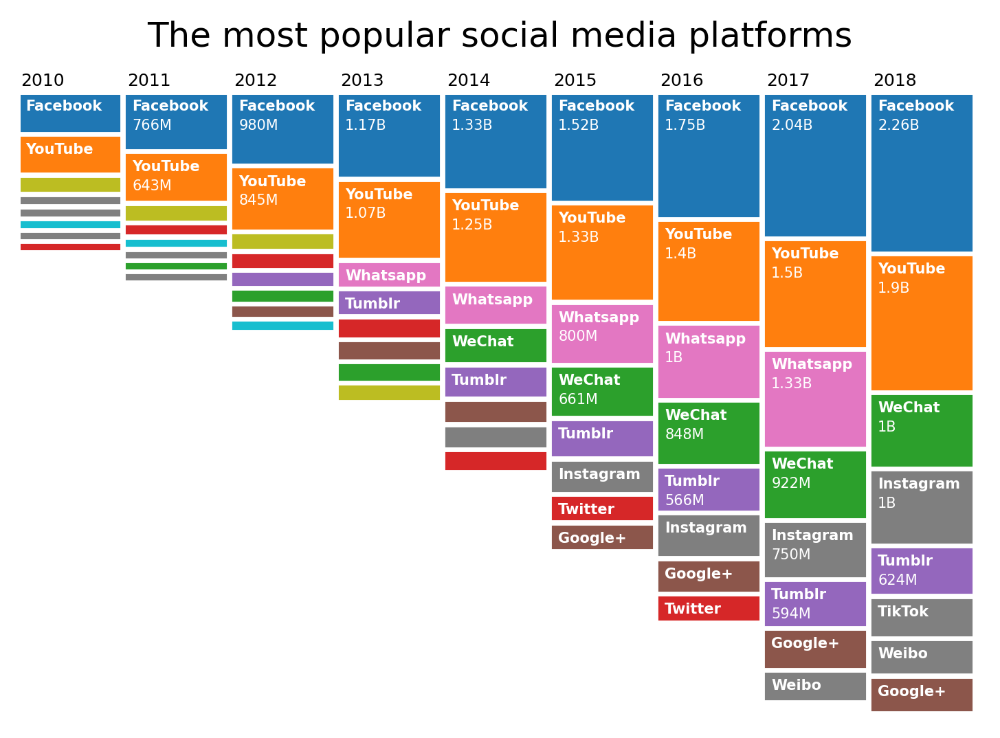

# Minimal ranking plot


### 1. Minimal example

```python
from rankplot import rankplot
import matplotlib.pyplot as plt

data = {2010: {'Facebook': 517750000, 'YouTube': 480551990, 'Google Buzz': 166029650, 'MySpace': 68046710, 'Hi5': 59953290, 'Flickr': 54708063, 'Orkut': 49941613, 'Twitter': 43250000}, 
        2011: {'Facebook': 766000000, 'YouTube': 642669824, 'Google Buzz': 170000000, 'Twitter': 92750000, 'Flickr': 66954600, 'Weibo': 48691040, 'WeChat': 47818400, 'Orkut': 47609080}, 
        2012: {'Facebook': 979750000, 'YouTube': 844638200, 'Google Buzz': 170000000, 'Twitter': 160250000, 'Tumblr': 146890156, 'WeChat': 118123370, 'Google+': 107319100, 'Flickr': 79664888}, 
        2013: {'Facebook': 1170500000, 'YouTube': 1065223075, 'Whatsapp': 300000000, 'Tumblr': 293482050, 'Twitter': 223675000, 'Google+': 205654700, 'WeChat': 196523760, 'Google Buzz': 170000000}, 
        2014: {'Facebook': 1334000000, 'YouTube': 1249451725, 'Whatsapp': 498750000, 'WeChat': 444232415, 'Tumblr': 388721163, 'Google+': 254859015, 'Instagram': 250000000, 'Twitter': 223675000}, 
        2015: {'Facebook': 1516750000, 'YouTube': 1328133360, 'Whatsapp': 800000000, 'WeChat': 660843407, 'Tumblr': 475923363, 'Instagram': 400000000, 'Twitter': 304500000, 'Google+': 298950015},
        2016: {'Facebook': 1753500000, 'YouTube': 1399053600, 'Whatsapp': 1000000000, 'WeChat': 847512320, 'Tumblr': 565796720, 'Instagram': 550000000, 'Google+': 398648000, 'Twitter': 314500000}, 
        2017: {'Facebook': 2035750000, 'YouTube': 1495657000, 'Whatsapp': 1333333333, 'WeChat': 921742750, 'Instagram': 750000000, 'Tumblr': 593783960, 'Google+': 495657000, 'Weibo': 357569030}, 
        2018: {'Facebook': 2255250000, 'YouTube': 1900000000, 'Instagram': 1000000000, 'WeChat': 1000000000, 'Tumblr': 624000000, 'TikTok': 500000000, 'Weibo': 431000000, 'Google+': 430000000}}
 ```   
```python 
fig, ax = plt.subplots()
ax = rankplot(data, ax=ax)
ax.set_title('The most popular social media platforms', y=1.05)
```


### Usage

```python
rankplot(data=None, labels=None,
    y_labels=None, color=None, color_map=None, grey_color='grey',
    trim=True, show_vals=True, hspace=0, vspace=0, labelpad=0, 
    label_fontsize=5, tick_fontsize=6, ax=None) 
```

#### Parameters

- data (`list` or `dict`): The ranking data. Can be a list of dicts with the label as key (`[{"John": 2, "Ali": 5}]`),
 a nested dictionary with the column label as key (`{'2010': {'John': 2, 'Ali': 2}}`) or a 2D array (`[[2, 5]]`).   
- labels (list, *optional*): 2D array in the same shape of the data, containing the labels. Mainly useful when the 
 input is a 2D array, otherwise labels are already extracted from the data. Defaults to None.
- y_labels (list, *optional*): Labels for the columns. Already extracted when the input is a nested 
 dictionary. Defaults to None.
- color (list or str, *optional*): The color(s) of the boxes. If one color is provided, all boxes 
 will get the same colors. If multiple colors are provided, the most frequent labels
  will be assigned a color. Defaults to None.
- color_map (dict, *optional*): Dictionary that allows for a custom mapping of labels to 
 specific colors. Overwrites the input of the color parameter. Defaults to None.
- grey_color (str, *optional*): Color for the labels that aren't included in color_map. Defaults to 'grey'.
- trim (bool, *optional*): Puts the last word of the label on a new line if the string if 
 wider than the box. Defaults to True.
- show_vals (bool, *optional*): Display the values in the box. Defaults to True.
- hspace (int, *optional*): Spacing between rows. Defaults to 0.
- vspace (int, *optional*): Spacing between columns. Defaults to 0.
- labelpad (int, *optional*): Spacing from the boxes to tick labels. Defaults to 0.
- label_fontsize (int, *optional*): Fontsize of the box labels. Defaults to 5.
- tick_fontsize (int, *optional*): Fontsize of the column labels. Defaults to 6.
-  ax (*matplotlib axes object*, *optional*): An axes of the current figure. Defaults to None.

